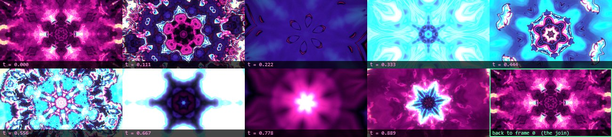
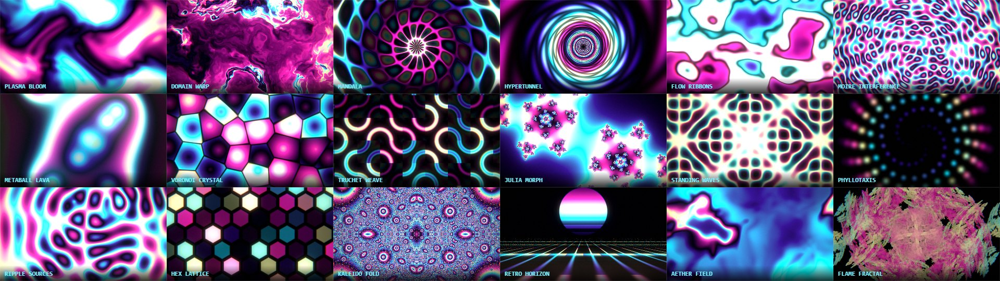

# Electric Loom

A self-hosted single-page generator for trippy, colourful, **perfectly looping** animated
backgrounds — GIF, WebM and PNG frame sequences, up to 1920x1080. Built for OBS.

No build step, no dependencies, no network. `index.html` is the whole application.

```bash
start index.html
```

That works straight off disk. For faster GIF encoding, run the local server instead — Chrome
blocks background workers on `file://` pages, so opening the file directly falls back to a
single-threaded encoder:

```bash
serve.cmd
```

---

## How the loop is guaranteed

This is the part that usually goes wrong in generators like this, so it is enforced structurally
rather than hoped for.

Time only ever enters a pattern as an angle, `TA = 2*PI*t` with `t` running 0 to 1 across the
loop, and **every coefficient multiplying that angle is an integer**. Those controls are the ones
labelled `x/loop` and they step in whole numbers in the UI. Anything built out of `sin`, `cos` or
a palette lookup of such a term is therefore bit-identical at `t=0` and `t=1`. Patterns that
scroll a tiled field instead move a whole number of tiles per loop; patterns that morph a fractal
walk their parameter around a closed circle. There are no cross-fades and no "close enough"
blends anywhere.

Three things had to be fixed to make that actually hold in practice, and they are worth knowing
about if you extend it:

- **Film grain** is hashed against the frame index, so the index is taken modulo the frame count.
- **Rotations** are reduced to a single turn before reaching the GPU. Letting a spin count
  accumulate drains the float mantissa and makes hard-edged patterns twitch at the seam.
- **`mod()` is not trustworthy.** Several drivers evaluate `mod(x,y)` as `x - y*floor(x*(1/y))`.
  With `y=6` the reciprocal rounds down and `mod(6.0, 6.0)` returns `6.0` instead of `0` — which
  is exactly the case a tile index hits at the seam. `imod()` in the shader prelude works around
  it. This was a real, visible bug, not a theoretical one.

**Verify loop** makes two measurements, because either one alone can mislead.

The strict probe asks whether `render(t=1)` is the same pixels as `render(t=0)`. That is the exact
statement of the loop rule, and it is what caught the grain, rotation and driver-modulo bugs. But
it is over-sensitive at extreme settings: `TA = 2*PI*t` reaches the shader as a float32, so at
`t=1` a term like `sin(ang * TAU * stripes)` can carry a phase error of a couple of thousandths of
a radian once `ang` has grown large. On a very fine pattern that is a sub-pixel shift of the whole
field, which the probe reports as a large per-pixel number and an eye would never see.

So the headline is **seam continuity**: the size of the step across the wrap against the size of an
ordinary step between neighbouring frames. Near 1 means the join is just another frame boundary.
Modulators are certified separately and directly — an RMS pixel comparison saturates on fast
content and will cheerfully call a modulator that leaps most of its range "seamless", so each one
is checked for continuity across its own wrap instead of being inferred from pixels.

Across
all 18 patterns, three framing regimes (including 12-fold kaleidoscope with mirror spin, palette
cycling, grain, bloom and chromatic aberration) and three frame rates, the strict probe measures a
worst difference of **1/255** — one least significant bit, below the resolution GIF quantisation
works at.

The GIF frame delays are integer centiseconds distributed so they **sum to exactly** the requested
duration, rather than each being rounded independently and letting the loop drift.

---

## Animating the controls

Any slider can be put in motion over the loop: press the wave button beside it and an LFO panel
drops in underneath. Shapes are **Sine**, **Triangle**, **Smooth noise** (value noise around a
closed ring, Catmull-Rom through it), **Harmonic drift** (a 1/f sum over whole harmonics with
seeded phases), **Swell** (a single eased rise and fall), **Pulse** and **Ramp**. Each has a rate
in whole cycles per loop, a depth as a fraction of that control's range, a phase, and a seed for
the two noise shapes. The marker on the slider track shows where the control actually is on the
frame being rendered.



**This cannot break the loop, and that is a property of the arithmetic rather than a promise.**
`render(t, p)` is already exactly periodic in `t` for any fixed `p`. Every modulator is exactly
periodic in `t`. So `render(1, p(1)) = render(1, p(0)) = render(0, p(0))`, and the loop closes for
free. The modulated value is rounded to float32 before use — the width it is uploaded at anyway —
so the two ends agree bit for bit rather than merely to within a rounding error.

Three things had to be got right, and each one was caught by a test rather than by reasoning:

- **Wrap `t` before adding the phase, not after.** `wrap1(1 + phase)` and `wrap1(0 + phase)` differ
  by one ULP of a double. That sounds harmless until `Math.round` turns it into a whole step on an
  integer control — a modulated "Petals" jumping from 8 to 9 between the last frame and the first.
  Seam differences of up to 127/255 came from this. `wrap1(1)` is exactly `0`, so wrapping first
  makes the two ends bit-identical.
- **Stepping shapes must not step on the seam.** Unshifted, a ramp resets and a pulse flips at
  exactly `x = 0`, which puts the one hard edge in the entire animation on the join. It reads as a
  broken loop rather than as a deliberate strobe. Both are offset into the body of the cycle; that
  took one measured case from a seam 21x an ordinary frame step down to 0.94x.
- **The continuity test has to look in the right place.** A rate that is not a whole number does
  *not* break the seam — `x = wrap1(t + phase)` advances straight through it for any rate. The jump
  lands at `t = 1 - phase`, in the middle of the loop. Just as visible, just as wrong, and nowhere
  near where you would look for it.

Measured across all 7 shapes and all 18 patterns, with roughly a dozen controls animated at once:
worst seam step **1.16x an ordinary step between neighbouring frames**. 21,000 randomised
modulators all return continuous; deliberately malformed ones are caught.

**Roll motion** sets one to three controls moving at modest depths, and **Randomize** now includes
motion, so a single press gives a look that breathes rather than one that merely spins. **M**
toggles all modulation, which is the quickest way to A/B it.

## The patterns

18 generators, all WebGL2 fragment shaders except the flame, which is a GPU chaos game.



| | | |
|---|---|---|
| Plasma Bloom | Domain Warp | Mandala |
| Hypertunnel | Flow Ribbons | Moire Interference |
| Metaball Lava | Voronoi Crystal | Truchet Weave |
| Julia Morph | Standing Waves | Phyllotaxis |
| Ripple Sources | Hex Lattice | Kaleido Fold |
| Retro Horizon | Aether Field | Flame Fractal |

**Flame Fractal** is the Electric Sheep one. Up to 2M points per frame run an iterated function
system in the vertex shader and splat additively into a float buffer, then get log-density tone
mapped. 25 classic flame variations, n-fold symmetry, and the IFS coefficients breathe on integer
harmonics so the attractor morphs and returns exactly. Its density reference is fixed rather than
per-frame — a per-frame maximum would make the brightness pump between frames and wreck the loop.

**Kaleido Fold** is the Kali set read through a nearest-approach orbit trap, with the fold constant
walking a circle once per loop.

**Aether Field** uses real 4D value noise sampled on a circle, so the texture genuinely evolves and
returns rather than sliding past.

On top of any pattern: zoom, pan, rotation, an n-fold kaleidoscope that can itself spin, a cyclic
palette that can rotate a whole number of times per loop, and a grade stack (bloom, exposure,
contrast, saturation, gamma, vignette, grain, chromatic aberration, posterise, scanlines).

## Palettes

20 built-in cyclic gradients plus a stop editor. Gradients interpolate in **OKLab** by default,
which is why they stay bright through the midpoint instead of going muddy the way sRGB lerping
does. sRGB and HSL are there if you want them. The last stop wraps to the first, which is what
makes palette rotation an exact loop.

## Export

Everything is written from scratch in the page — there is no library in here.

**GIF.** Two passes. The first renders frames sampled across the whole loop and builds a 6-6-6
histogram; a modified median cut with optional k-means refinement picks one global palette, and a
262144-entry nearest-colour cache makes the per-pixel mapping O(1). The second pass renders every
frame, dithers, and LZW-compresses it. One global palette across all frames means colours never
shift or flicker between them. Dither options are Floyd–Steinberg, Sierra Lite, Atkinson, ordered
8x8 and 4x4, or none, all with a strength control; ordered dithering compresses noticeably smaller
and is temporally stable, error diffusion looks smoother on gradients. Palette size 8–256.
Encoding runs across a worker pool and keeps full speed even if you switch tabs.

**WebM.** WebCodecs `VideoEncoder` (VP9, VP8 or AV1) with exact per-frame timestamps, muxed by a
hand-written Matroska writer. The file is exactly the length you asked for. Falls back to
MediaRecorder real-time capture where WebCodecs is unavailable.

**PNG frames.** A store-method ZIP with correct CRC32s, one PNG per frame, full alpha.

**Alpha.** Set Background to "Alpha from brightness" for cut-out overlays. Full alpha in the PNG
sequence, 1-bit in the GIF. Not written to WebM.

## OBS

Use a **Media Source** for both GIF and WebM. Tick *Loop*, untick *Restart playback when source
becomes active* so it does not hitch on scene changes, leave *Close file when inactive* off.

WebM beats GIF for a full-screen background — full colour, no banding, roughly 10–40x smaller. Keep
the GIF for browser sources and anywhere that only takes images. These patterns are all smooth, so
a 1280x720 file scaled up in OBS looks near identical to native 1080p and encodes several times
faster.

## Keys

`space` play/pause · `R` randomize · `P` reroll params · `←`/`→` step a frame · `S` seam check ·
`V` verify loop · `M` modulation on/off · `G` render GIF · `W` render WebM

Double-click any slider readout to reset that control. The address bar carries the whole look, so
**Copy link** shares a reproducible result; looks can also be saved to local storage and exported
as JSON.

---

## Hosting it

Everything runs in the visitor's browser. The server's entire job is to hand
over one static file: **180 kB raw, 57 kB gzipped, 49 kB brotli**. There is no
API, no upload, no render queue, no database. A visitor rendering a 450-frame
1080p GIF costs the server exactly nothing beyond that first response, because
the WebGL, the quantizer, the LZW compressor and the muxer all run on their
machine.

That makes the bandwidth arithmetic pleasant: at ~50 kB a visit, **1 TB of
monthly transfer is about 20 million page views**. 10,000 visits is 500 MB. The
constraint on this service will never be hosting cost.

### As a flake

```nix
inputs.electric-loom.url = "github:YOURNAME/electric-loom";
inputs.electric-loom.inputs.nixpkgs.follows = "nixpkgs";
```

```nix
{
  imports = [ electric-loom.nixosModules.default ];

  services.electric-loom = {
    enable = true;
    domain = "loom.example.com";
    openFirewall = true;
  };

  security.acme.acceptTerms = true;
  security.acme.defaults.email = "you@example.com";
}
```

That is the whole deployment. The module builds the site, sets up the nginx
virtual host with ACME and HTTPS, sends a locked-down Content-Security-Policy,
serves the pre-compressed files, and marks `index.html` `no-cache` (it has no
content hash in its name, and revalidating 50 kB is free) while letting the
images sit in cache for a week.

Worked examples are in [`examples/`](examples/). Other outputs:

| | |
|---|---|
| `nix build` | the site as a directory of static files |
| `nix run` | serve it locally on :8777 |
| `nix flake check` | build it and run the GIF encoder round-trip suite against the built file |
| `nix develop` | node, python, gzip, brotli |
| `overlays.default` | `pkgs.electric-loom` |

Useful options: `siteUrl`, `enableACME`, `forceSSL`, `gzipStatic`,
`brotliStatic`, `referrerPolicy`, `extraLocationConfig`, `virtualHostConfig`,
and the `ads.*` and `contentSecurityPolicy.*` trees below.

`gzipStatic` defaults to on and needs nginx built with
`http_gzip_static_module` (the nixpkgs default is). If your nginx lacks it,
nginx rejects the config at rebuild time — set `gzipStatic = false`.
`brotliStatic` is off by default because it needs
`services.nginx.additionalModules = [ pkgs.nginxModules.brotli ];`.

### The build without Nix

`build.sh` is the single source of truth — the Nix derivation calls it, so
what the flake produces is what you get locally.

```bash
OUT=dist ./build.sh                  # full site into dist/
OUT=. SINGLE_FILE=1 ./build.sh       # regenerate the committed index.html
```

### Content-Security-Policy

The default policy allows exactly what the application needs and nothing else:

```
default-src 'none'; script-src 'self' 'unsafe-inline' 'unsafe-eval' blob:;
worker-src blob:; style-src 'self' 'unsafe-inline'; img-src 'self' data: blob:;
media-src 'self' blob:; connect-src 'self' blob: data:; frame-src 'none';
font-src 'self' data:; base-uri 'none'; form-action 'none';
frame-ancestors 'none'; object-src 'none'
```

`'unsafe-inline'` is unavoidable while the application is one inline
`<script>`; `'unsafe-eval'` covers the encoder's `new Function` fallback for
browsers where workers are unavailable; `blob:` covers the worker pool. This
was verified by serving the built file with that exact header and checking that
the worker pool spawns, the fallback constructs, and GIF, WebM and PNG exports
all complete.

### Third-party code

There is one supported way in, and it is declarative:

```nix
services.electric-loom.ads = {
  headSnippet = "...";   # injected before </head>: ad loader, CMP, analytics
  railSnippet = "...";   # injected into the sponsored rail in the right column
  bodySnippet = "...";   # injected at the end of <body>
};
```

With all three empty — the default — the built page makes **no network requests
at all**. The sponsored rail deletes itself at boot when nothing was injected,
and carries a "Sponsored" label when something was.

Any host a snippet talks to must also be named in
`contentSecurityPolicy.extraScriptSrc` / `extraImgSrc` / `extraFrameSrc` /
`extraConnectSrc`, or the browser blocks it. That is on purpose: adding
third-party code to this page should be two deliberate decisions, not one
forgotten one.

### If you monetise it

Three things worth knowing before wiring up a network:

- **The audience blocks ads.** OBS streamers and developers run blockers at
  rates far above the general web. Whatever RPM a network quotes, assume a
  large fraction of this traffic never sees an impression.
- **A one-page tool with no prose is a hard sell to ad networks.** Programmes
  that review sites tend to reject "low value content", and a single app screen
  qualifies. A gallery of example loops, a page of OBS setup notes and some
  written docs help with both the review and with search traffic.
- **Consent is not optional for EU or UK visitors.** Personalised ads there
  need a certified consent management platform, loaded before the ad script.
  That is what `headSnippet` is ordered for.

The honest structural point is that hosting is nearly free, so the bar for
"worth it" is low — but so is the ceiling. For a tool with this audience,
sponsorship of the project, a tip link, or a paid tier built around something
the client genuinely cannot do alone will likely out-earn display ads. Anything
gated purely in client-side JavaScript can be bypassed by anyone who opens the
file, so a paid tier has to be built on something server-side to mean anything.

### Licensing

There is no LICENSE file yet. Publishing the repo and taking ad revenue on a
hosted copy are both easier decisions with one in place, and consumers of the
flake will want to know where they stand. Worth settling before it goes public.

---

## Repo layout

`index.html` is generated by concatenating the numbered parts in `build/`:

```bash
cat build/p0*.txt build/p10_boot.txt > index.html
```

Edit the parts, not `index.html`. `build/test_gif.js` is a Node test that pulls the GIF encoder
back out of the built file and round-trips it against an independent LZW decoder — flat fields,
ramps, white noise large enough to force multiple dictionary resets, every dither mode, every
palette size, the transparency path, and a full container walk:

```bash
node build/test_gif.js
```
